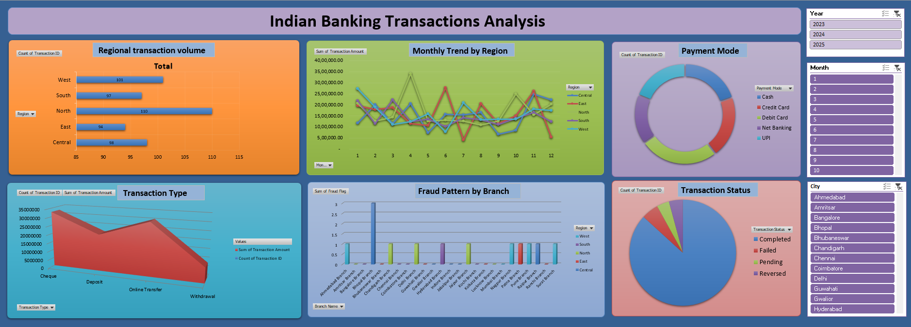

# Indian Banking Transactions Analysis

> Where the money moves, where it fails, and where fraud hides — across regions, branches, and payment modes.

An interactive Excel dashboard analyzing Indian banking transaction data to surface regional performance, digital payment adoption, fraud concentration, and transaction success rates. Built with Pivot Tables, Pivot Charts, and slicers for live drill-down by year, month, city, region, and transaction type.

---



---

## 📌 What This Project Does

Banking transaction logs are dense and high-volume — patterns in fraud, regional growth, and payment behavior stay buried until they're modeled. This dashboard turns raw transaction records into an operations-ready view that bank management can filter and act on.

**Interactive filters:** Year · Month · City · Region · Transaction Type

---

## 📊 Dashboard Breakdown

**Regional Transaction Volume** — Compares transaction counts across regions to flag high-performing zones.

**Monthly Trend by Region** — Tracks transaction amount over time to expose seasonal patterns.

**Payment Mode Distribution** — Cash, Credit Card, Debit Card, Net Banking, UPI — digital adoption at a glance.

**Transaction Type Analysis** — Cheque, Deposit, Online Transfer, Withdrawal.

**Fraud Pattern by Branch** — Isolates branches with elevated fraud flags for risk monitoring.

**Transaction Status Breakdown** — Completed, Failed, Pending, Reversed.

---

## 💡 Key Insights

- **North region** leads in transaction volume
- **Online transfers** dominate by transaction amount
- **UPI and Debit Card** are the leading digital payment methods
- Majority of transactions complete successfully — a healthy success rate
- Fraud cases are **concentrated in specific branches**, not spread evenly — a targeted risk signal

---

## 🎯 Business Use Case

Built to help bank management track branch performance, flag fraud-prone branches, monitor digital payment adoption, and analyze regional growth trends.

---

## 🛠 Stack

`Microsoft Excel` `Pivot Tables` `Pivot Charts` `Slicers` `Data Cleaning`

---

## 🗂 Repository Structure

```
Indian_Banking_data.xlsx              → Full workbook (data + pivots + dashboard)
Indian_Banking_data_Dashboard.png     → Dashboard screenshot
```

---

## 📬 Connect

[](https://www.linkedin.com/in/shenbaga-arun/)
[](https://shenbagaarunk.github.io/)
